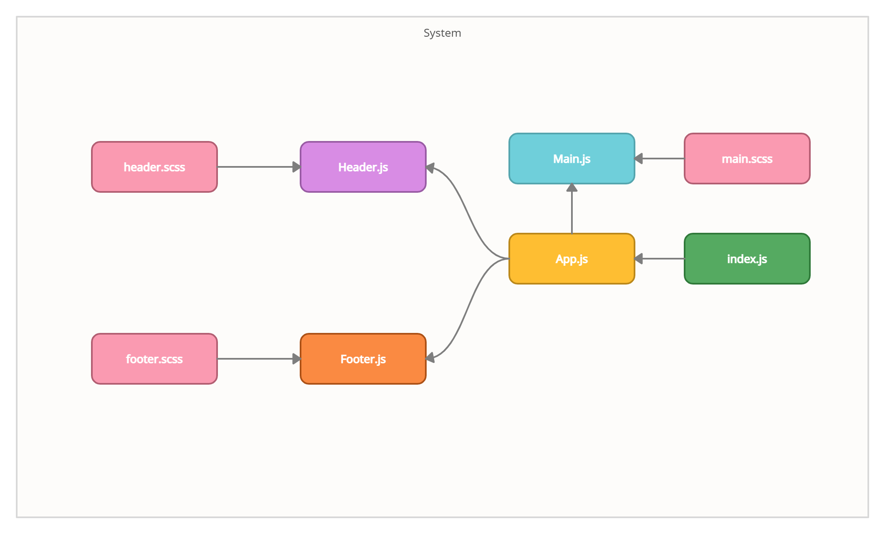

# RESTyAPP
# Author: Reem Alqurm

# Deployed link 

*  [Netlify](https://60c9dba4caade1adf30ad5c4--relaxed-carson-f8f1b4.netlify.app/) 
* [GitHub pages](https://reem-alqurm.github.io/resty/)
# Setup:
 * To create a react app: npx create-react-app app-name
 * To start the app: npm start
 * To use Sacc for styling: npm i node-sass
# UML
